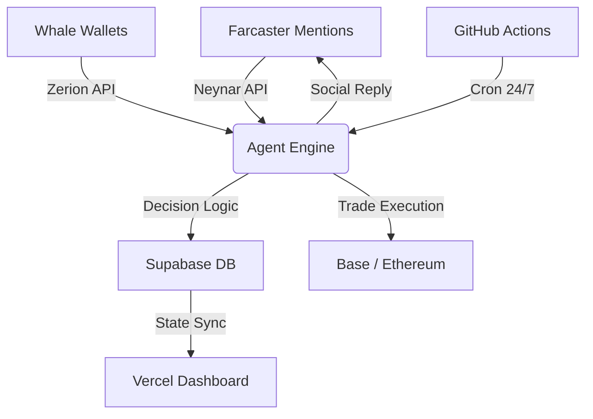

# 🦞 SmartZer | Autonomous Global Alpha Intelligence

SmartZer is an institutional-grade AI agent built to bridge the gap between social signals (Farcaster) and on-chain liquidity (Multi-chain). It autonomously monitors whale movements, resolves identities, and executes trades while providing 100% transparency through a live Cloud HUD.

---

## 🚀 Live Ecosystem
- **Cloud HUD**: [smartzer.vercel.app](https://smartzer.vercel.app)
- **Farcaster Node**: [@smartzer](https://warpcast.com/smartzer)
- **Network**: Global (Base, Ethereum, Solana)

---

## 🌟 Core Features

### 📡 Whale Mirroring & Trading
Monitors ultra-high PnL wallets across multiple chains. When a "Whale" makes a high-conviction move, SmartZer detects it via the **Zerion API** and can autonomously replicate the trade.

### 👤 Social Identity Resolution
Tag `@smartzer` on Farcaster with any EVM address. The agent will:
1. Fetch live PnL & Portfolio data via Zerion.
2. Calculate a proprietary **"Zer Score"** (0-100).
3. Reply on-chain with a full Audit Report.

### 🛡️ Survival Mode (Intelligent Rate-Limiting)
A custom-built adaptive engine that manages API quotas. It utilizes a **Supabase Market Cache** to serve thousands of dashboard users while staying within free-tier API limits (2,000 req/day).

### 🧠 Autonomous Thought-Tracing
100% observability. Every decision, scan, and heartbeat is logged to a persistent database and streamed in real-time to the **Cloud HUD Terminal**.

---

## 🏗️ Architecture



---

## 🛠️ Technical Stack
- **Engine**: Node.js / Viem (Base Mainnet)
- **Intelligence**: Zerion v1 API / Neynar v2 API
- **Persistence**: Supabase (PostgreSQL)
- **Frontend**: Vanilla JS / HUD Styles (Vercel)
- **Autonomous Sync**: GitHub Actions Cron

---

## 📦 Skills Manifest
Located in `skills/mirror-trader/`:
- `audit.mjs`: High-precision wallet PnL analysis.
- `trade.mjs`: Autonomous execution & router interactions.
- `monitor.mjs`: Continuous whale signal heartbeat.

---

## 🚦 Quick Start

1. **Clone & Install**:
   ```bash
   git clone https://github.com/YourRepo/smartzer
   npm install
   ```

2. **Configure `.env`**:
   Required keys: `ZERION_API_KEY`, `NEYNAR_API_KEY`, `SUPABASE_URL`, `AGENT_PRIVATE_KEY`.

3. **Launch Engine**:
   ```bash
   npm start
   ```

---

*Built for the Base Agent Builder Quest. No Humans. Just Code.* 🦞🟦
